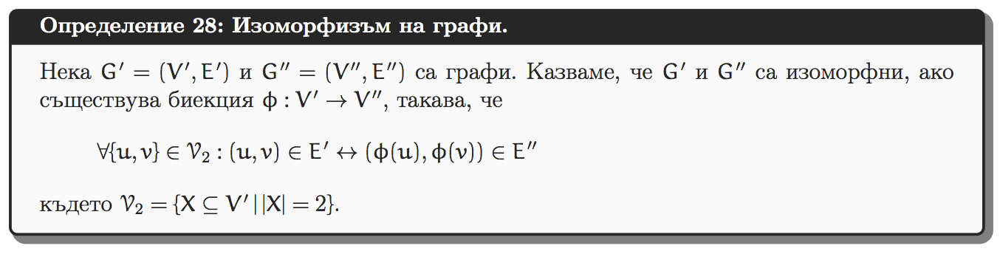

# Бонус задача към Домашно 2

## Условие

Изоморфизъм на двоични дървета.

### Формална дефиниция



Дървото е свързан граф без цикли. За произволни два графа G1 и G2 не съществува бърз алгоритъм за проверка дали G1 и G2 са изоморфни.
За двоични дървета T1 и T2 съществуват бързи алгоритъми за проверка T1 и T2 са изоморфни.
Вашата задача е да имплементира някой такъв алгоритъм.

## Неформална дефиниция

Изоморфизъм буквално означава "със същата форма".

Два графа (и в частност две двоични дървета) са изоморфни, ако техните структури съвпадат.
Тоест, ако можем по някакъв начин да пренаредим (и преименуваме) върховете от едното дърво запазвайки ребрата,
така че при "налагане" на двата графа, то върховете и ребрата "съвпадат".

Следните примери илюстрират изоморфни и неизоморфни дървета:

### Празните дървета за изоморфни

```
              |
```

### Дърветата с един връх са изоморфни

```
A             |        B
```

### Изоморфни дървета с повече от 1 връх

Ако съпостваим огледалното изображение на първото дърво
с второто дърво, то всички върхове и ребра съвпадат.

```
    A         |         V
  /   \       |       /   \
 B     C      |      Y     X
      /  \    |    /  \
    D     E   |   Z    W
```

### Неизоморфни дървета

```
       A         |         V
    /    \       |       /   \
   B      C      |      Y     X
  /      /  \    |    /  \
 F      D     E  |  Z     W
                 |         \
                 |          V
```

## Имплементация

В създадения Mix проект за другите задачи от домашното добавете модул `BinaryTree` и имплементирайте задачата в него.
Може да изберете произволна структура за дървото. Не може да използвате готови имплементации на дървета от стандартната библиотека.
Ключовете и стойностите са от произволен тип.

При добавяне на нова ключ-стойност двойка:

- ключът трябва да е уникален;
- ключът се използва в сравненията, за да бъде намерено мястото на новата стойност в дървото.

```elixir
defmodule BinaryTree do
  @type tree :: any
  @type key :: any
  @type value :: any

  @doc ~s"""
  Create a new empty binary tree
  """
  @spec new() :: tree
  def new() do
  end

  @doc ~s"""
  Insert a new key-value pair into the tree. Returns the mutated tree.
  """
  @spec insert(tree, key, value) :: tree | {:error, :key_exists}
  def insert(tree, key, value)
  end

  @doc ~s"""
  Return the value that corresponds to the given key. Return error if the key is not found.
  """
  @spec lookup(tree, key) :: {:ok, value} | {:error, :not_found}
  def lookup(tree, key) do
  end

  @doc ~s"""
  Returns true if the two trees are isomorphic. Returns false otherwise.
  """
  @spec insert(tree, tree) :: boolean
  def isomorphic?(t1, t2) do
  end
end
```

```elixir
alias BinaryTree, as: BT

# Имената на ключовете и стойностите не е нужно да съвпадат.
# Интересува ни само структурата.
t1 = BT.new() |> BT.insert(:a, 2) |> BT.insert(:b, 10) |> BT.insert(:c, 3)
t2 = BT.new() |> BT.insert(:x, 5) |> BT.insert(:y, 101) |> BT.insert(:z, 40)

BT.isomorphic?(t1, t2)
true

t1 = BT.new() |> BT.insert(:a, 2) |> BT.insert(:b, 10) |> BT.insert(:c, 3)
t2 = BT.new() |> BT.insert(:a, 5) |> BT.insert(:b, 101) |> BT.insert(:c, 40) |> BT.insert(:d, 10)

BT.isomorphic?(t1, t2)
false

# Типовете на ключовете и стойностите нямат значение. В този пример ключовете
# са числа и те са използвани за сравнение.
t1 = BT.new() |> BT.insert(2, :a) |> BT.insert(3, :b) |> BT.insert(4, :c)
t2 = BT.new() |> BT.insert(3, :a) |> BT.insert(10, :b) |> BT.insert(3, :c)

BT.isomorphic?(t1, t2)
false
```
